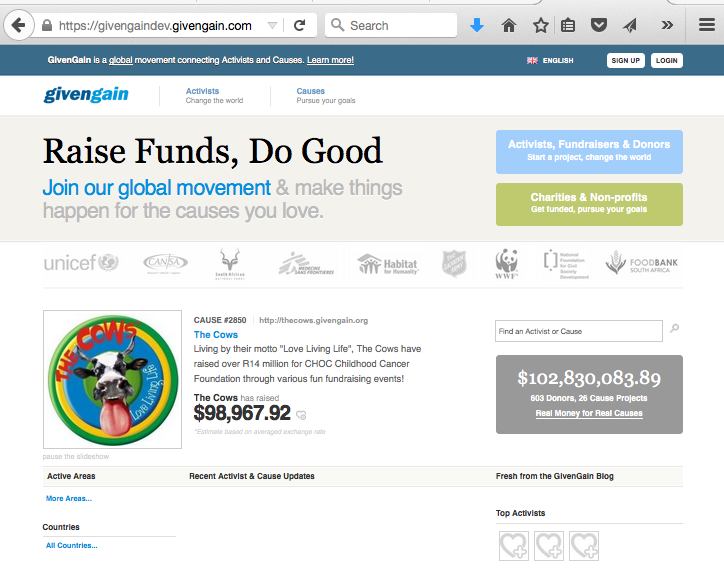
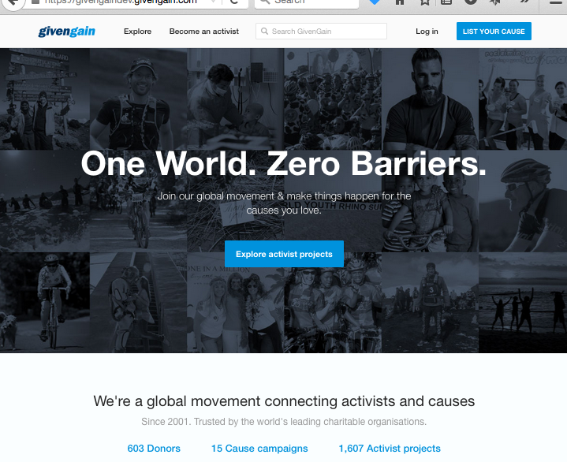
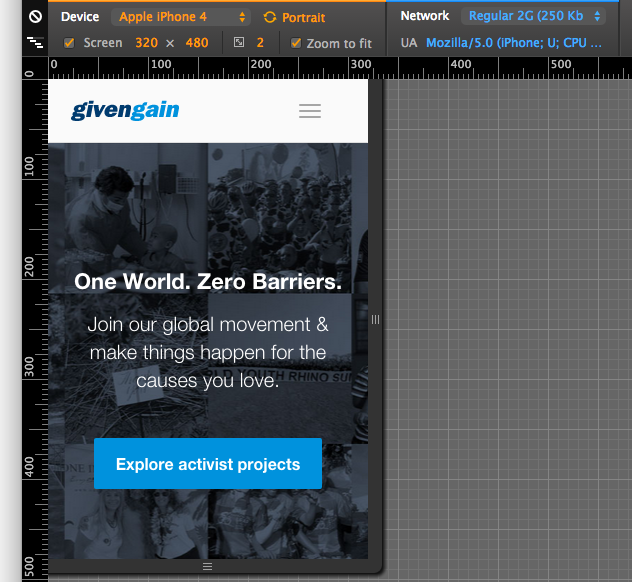

Using Mojolicious for Fun and Nonprofit

[Lee Johnson](http://leejo.github.io)

~~Swiss Perl Workshop September 2014~~

London Perl Workshop December 2015

---
## About Me?


---
## About Me?

+ Perl developer for 10+ years
+ Occasional contributor to CPAN
+ More active recently:
    - Uploading to CPAN ([pause: LEEJO](https://metacpan.org/author/LEEJO))
    - Forky forky ([github: leejo](https://github.com/leejo))
    - [Blog](http://leejo.github.io)
    - Primary maintainer of CGI.pm
    - This!
+ Moved to Suisse mid-2013

---
## Nonprofit?

---
## Nonprofit

### [GivenGain Group Services](http://www.g3s.ch/)

The GivenGain Foundation is based in the Canton of Vaud, Switzerland, and is a nonprofit organization registered in Switzerland. The Foundation manages all donations made to GivenGain projects.

Although many other donation management services are for-profit enterprises, the founders of GivenGain believe that managing donations through a supervised Foundation creates greater value for the global non-profit community. The Foundation does not pursue any political, religious or sectarian goal - it serves human rights.

---
### GivenGain Group Services

+ Founded in 2001
+ Offices in Switzerland (Villars-sur-Ollon), South Africa (Stellenbosch), UK (Sevenoaks).
+ 95%+ perl development

---
## Fun?

---
## Fun?

+ Modern perl development tools
    * Moose/Moo/Mouse
    * DBIx::Class
    * Web Frameworks
    * Test::*
    * perlbrew/plenv/Pinto/Carton/etc
+ Modern development methods
    * Distributed VCS (git)
    * Code reviews
    * Continuous Build/Deployment
    * Automated systems infrastructure (AWS)
    * Workshops and training

---
## Not Fun.

+ "Legacy" perl code
    * CGI.pm
    * No strict or warnings
    * Global variables
    * Poor separation of concerns
    * Own templating language/syntax
    * No real use of perl idioms
    * No automated tests
    * System/Vendor supplied perl (i.e. old)

---



---
## This is not *bad* code

+ Running without problem for 15 years
+ Steady increase in functionality
+ Over $100million raised for causes

It's just not fun code to work with.

---
So how do we make this fun?

+ Address previous problems in existing code?
    * No.
        * difficult, would just be band-aids
        * no automated tests!

+ Re-write the app from the ground up?
    * Heck no!
        * I shouldn't have to explain why...

+ Gradually migrate functionality into new system?
    * That might work...

---
## Mojolicious?

---
## Why Not?

+ Dancer(2)
+ Catalyst

---
## Mojolicious

["Next generation web framework"](http://mojolicio.us/)

---
## Mojolicious

"Next generation web framework"

websockets; event-driven; non-blocking; hot code reloading; parallel requests; concurrent requests; SSL certificate auth; embedded apps; user agent; IPv6; PSGI support; RESTful routes; JSON parsing; DOM parsing; CSS3 selectors; Multipart support; Tag helpers; plugins; perl-ish templates; session management; and on, and on, and on.

---
## Mojolicious::Lite

```perl
    #!/usr/bin/env perl

    # automatically enables strict, warnings, utf8 and 5.10 features
    use Mojolicious::Lite;

    any '/hello_world' => sub {
        my ( $self ) = @_;
        $self->render( text => "Bonjour à tous" );
    };

    post '/hello_to' => sub {
        my ( $self ) = @_;

        my $params = $self->req->json;

        $self->render(
            status => 200,
            json   => {
                hello    => $params->{who},
                complete => Mojo::JSON->true,
            },
        );
    };

    app->start;
```

And run it:

```
morbo hello_world_mojo_lite.pl
```

---
## [Mojolicious::Lite](http://mojolicio.us/perldoc/Mojolicious/Lite)

+ Tiny standalone apps
+ Testing infrastructure (emulators, etc)
+ Great for prototyping: easy to convert to a full-fat app

---
## CGI.pm and Mojolicious?

---
## CGI.pm and Mojolicious

[Mojolicious::Plugin::CGI](https://metacpan.org/pod/Mojolicious::Plugin::CGI)

```perl
    #!/usr/bin/env perl

    use Mojolicious::Lite;
    use Mojolicious::Plugin::CGI;

    plugin CGI => [ '/hello_world' => "hello_world.cgi" ];

    app->start;
```

The CGI script:

```perl
    #!/usr/bin/env perl

    use strict;
    use warnings;
    use utf8;
    use CGI qw/ -utf8 /;

    my $cgi = CGI->new;

    binmode( STDOUT,":utf8" );

    print $cgi->header( -type => 'text/html', -charset => 'utf-8' );
    print "Bonjour à tous depuis CGI.pm";
```

---

## CGI.pm and Mojolicious

```perl
    #!/usr/bin/env perl

    use Mojolicious::Lite;
    use Mojolicious::Plugin::CGI;

    any '/hello_world' => sub {
        my ( $self ) = @_;
        $self->render( text => "Bonjour à tous PAS depuis CGI.pm" );
    };

    # this is now redundant, the above route will take priority
    plugin CGI => [ '/hello_world' => "hello_world.cgi" ];

    app->start;
```
---

## An Example

[http://www.givengain.com/explore/projects/](http://www.givengain.com/explore/projects/)

---

## An Example

[http://www.givengain.com/explore/projects/](http://www.givengain.com/explore/projects/)

Previously:

+ 1000 line cgi script (with aforementioned legacy issues)
  + called by 600 line wrapper script (with aforementioned legacy issues)
  + using functions from 1000 line library (with afore...)
  + using 100 line [custom syntax] template
  + perl 5.10.1 (system perl)

---

## An Example

[http://www.givengain.com/explore/projects/](http://www.givengain.com/explore/projects/)

Now:

+ 350 line Mojolicious controller (fully tested)
  + calls 500 line Projects object (Moose, roles, DBIC, fully tested)
  + calls 100 line Categories object (Moose, roles, DBIC, fully tested)
  + uses 100 line [Template::Toolkit] template
  + perl 5.16.3 and in the process of upgrade to 5.22.0

---
## An Example

We can easily enable the new code or rollback to the old code:

```perl
    # new routes
    $r->route('/explore/projects/')->to('public-explore#projects');

    ...

    # old routes
    ...
```

---
## An Example

We can easily test the new code and the old code with no changes to tests:

```
#!perl

use strict;
use warnings;

use Test::Most;
use Test::Mojo;

my $t  = Test::Mojo->new( "GivenGain" );

foreach my $url (
    [ '/influence/', \&_ordered_by_influence_points ],
) {
    my $link  = $url->[0];
    my $order = $url->[1];

    $t->get_ok("/explore/projects$link")
        ->status_is(200)
        ->content_like(qr/Explore Projects/i);

    $t->tx->res->content =~ /Explore Projects/i
        && $order->( $t );
}

done_testing();

sub _ordered_by_influence_points {

    my ( $t ) = @_;

    my @influence_points =
        map { $_ =~ s/\D//g; $_ }
        $t->tx->res->content->build_body =~ /\((.+) iPV\)/g;

    cmp_deeply(
        \@influence_points,
        [ sort { $b <=> $a } @influence_points ],
        'links ordered by influence points descending'
    );
}
```

Of course the new code has its own unit tests that exist outside the framework.

---



---



---
## Mojolicious Lessons Learnt?

---
## Mojolicious Lessons Learnt?

Mojolicious moves slightly less fast than it used to

```
Day changed to 12 sep 2014
...
03:07 <+cpan_mojo> Mojolicious 5.40 by Sebastian Riedel -
                   http://metacpan.org/release/SRI/Mojolicious-5.40
03:10 < sri> \o\
03:10 < sri> /o/
03:11 < sri> BREAK ALL THE THINGS

[3:#mojo(+n)]
```

Not as true these days

---
## Mojolicious Lessons Learnt

Mojolicious moves slightly less fast than it used to


(This has implications that go beyond your code)

---
## Mojolicious Lessons Learnt

Mojolicious [documentation](http://mojolicio.us/perldoc) and learning curve

---
## Mojolicious Lessons Learnt

Mojolicious defaults

+ server [settings](http://mojolicio.us/perldoc/Mojo/Server/Hypnotoad) may not suit you
+ exception [pages](http://mojolicio.us/perldoc/Mojolicious/Guides/Rendering#Rendering_exception_and_not_found_pages) should be [added](http://blog.kraih.com/post/43196937506/a-missing-raptor-and-the-mojolicious-user-experience)
+ template [syntax](http://mojolicio.us/perldoc/Mojo/Template) is its own

---
## In Summary

---
## In Summary

+ A path to migrate a legacy CGI.pm app
    - But with easy rollback if necessary
    - Removes an awful lot of boilerplate
+ Modern perl development methods
+ Tests!

---
## Questions?
